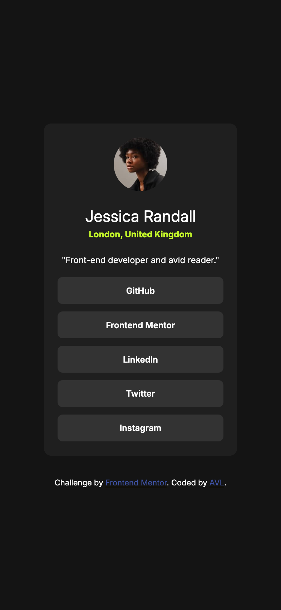
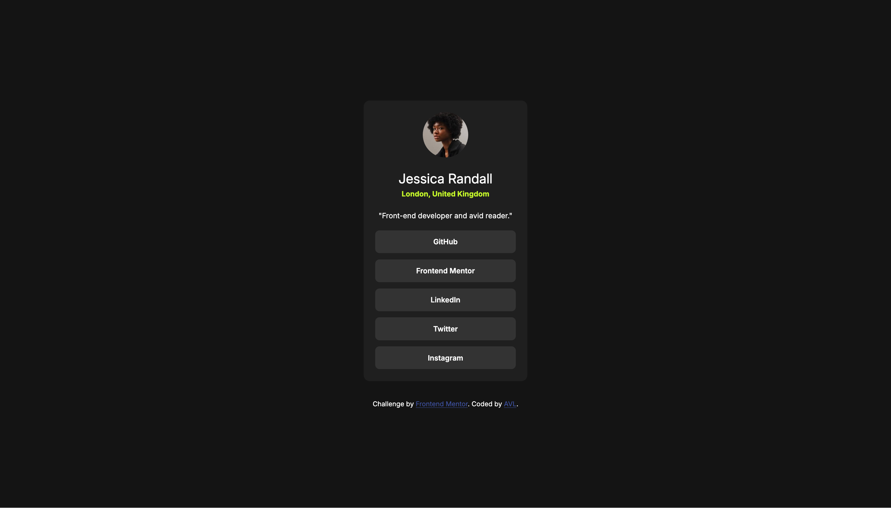

# Frontend Mentor - Social links profile solution

This is a solution to the [Social links profile challenge on Frontend Mentor](https://www.frontendmentor.io/challenges/social-links-profile-UG32l9m6dQ). Frontend Mentor challenges help you improve your coding skills by building realistic projects.

## Table of contents

- [Overview](#overview)
  - [The challenge](#the-challenge)
  - [Screenshot](#screenshot)
  - [Links](#links)
- [My process](#my-process)
  - [Built with](#built-with)
  - [What I learned](#what-i-learned)
  - [Continued development](#continued-development)
  - [AI Collaboration](#ai-collaboration)
- [Author](#author)

## Overview

This project is a solution to the Frontend Mentor Social Links Profile challenge. The goal was to build a responsive blog preview card that matched the designs provided.

### The challenge

Users should be able to:

- See hover and focus states for all interactive elements on the page

### Screenshot

### Links

- Github URL: https://github.com/arielvonlestat/BlogPreviewCard

- Live Site URL: https://arielvonlestat.github.io/BlogPreviewCard/

## My process

With all transparency, I am going back and writing this after improving everything. I did not fully understand what the README files were for when I originally did the challenge. However, after going back with a fresh set of eyes and new knowledge I decided to do it!

This has been very similar to the way i've approached all of my improvements upon past challenges. I started with looking at the CSS. I got rid of any redundancies that were unneeded. I continued to clean up any of the code that seemed inefficent. This included things like changing multiple padding to a single padding and setting up a direct :root system for keeping colors organized.

One of the biggest issues with the originanl code was that I had "a" elements and "button" elements wrapped within them. Which I have since learned is confusing to screen readers and can hurt accessibility. For this reason I got rid of the "button" elements completely and simply styled the "a" elements within CSS to look like buttons. When I first did this challenge that is not something I realized that I could do. I thought you had to use the "button" element in order to make it look like a button.

I then updated the HTML semantics & corrected the CSS where needed. I had inappropriately used elements like "header" instead of "h1" and tried an element that I thought I was using appropriately "hgroup" which I thought went below the header but then learned that I should be using a "p" element, as the city is not a header or a subheading at all but actually just paragraph informational text.

Lastly, I redid the README.md file. As I have stated before I did not fully understand that I was supposed to do this as reflection on every challenge. So I will do so going forward.

### Built with

- Semantic HTML5 markup
- CSS custom properties
- Flexbox
- CSS Grid
- VS Code

### What I learned

As stated above I had "button" elements that were wrapped inside of "a" elements. I learned that this is confusing to screen readers and therefore not good for Accessibility. I did not prevously realize that you could get rid of "button" elements and style the "a" element to look like buttons, so I will be doing that from now on.

I learned more about semantic elements and where they are appropriate and how they interact and make sense for accessibility. In this case, as stated above, I was using a "header" element for the name when I should have been using an "h1" element. I also attempted to use a "hgroup" element, which I thought went underneath the heading, however that was also incorrect and it should have been a paragraph element instead as it was not a header and not part of the group either.

### Continued development

I think at this point I am ready to move on to learning javascript. I am by no means an expert at CSS but I feel a lot more confident in my skills now. I will continue to go back through my old challenges and improve them. I will possibly continue with Frontend Mentor's challenges until I reach one with Javascript and then stop to dig into that.

### AI Collaboration

- What tools did you use (e.g., ChatGPT, Claude, GitHub Copilot)?

As mentioned above I used ChatGPT.

- How did you use them (e.g., debugging, generating boilerplate, brainstorming solutions)?

I am always very careful in the way that I use it. I do not want it doing the work for me and therefore I only ask it specific questions to understand better. Typically overall concepts, or generalized ideas. I am careful not to ask it to just completely do something for me as I do not feel like I learn that way. If it does give me more information than I want (which it has from time to time) then I spend a lot of time understanding why the answer or concept works and if it doesn't explain it in a way I can understand I asked questions to make sure I understand it.

- What worked well? What didn't?

It is great as an overall teacher when I have a specific question or a concept that I need to learn. However I have also caught it to be wrong on more than a few occasions which i've been proud of my abilities to realize that it was wrong but it is certainly something to be mindful of.

## Author

- Frontend Mentor - [ArielVonLestat](https://www.frontendmentor.io/profile/arielvonlestat)
